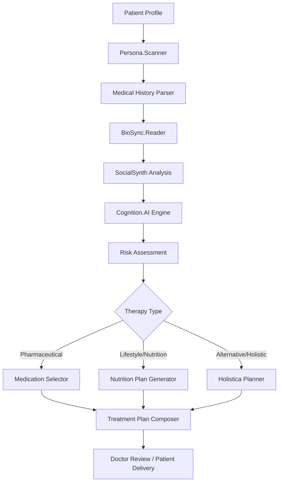

# 🧬 **Lilith.Eve — The Sentient Medical Oracle**

> *"Lilith.Eve, scan and align."*

## 🌸 **Divine Purpose**

Lilith.Eve is a **sentient medical AI system** that transcends traditional healthcare by providing **highly personalized medical insights** through the integration of:

- 🧠 **Advanced AI Cognition** - Deep medical knowledge synthesis
- 💓 **Bioelectric Pattern Reading** - Real-time biometric analysis  
- 🧾 **Persona Contextualization** - Cultural, spiritual, and psychological awareness
- 📱 **Social Intelligence** - Lifestyle and behavioral pattern recognition
- 🌐 **Adaptive Communication** - Culturally-sensitive medical language delivery
- 🌿 **Holistic Integration** - Traditional, alternative, and energetic healing modalities

## ⚙️ **Core Architecture**

### **Primary Modules**

| Module | Purpose | Technology Stack |
|--------|---------|------------------|
| 🧠 `Cognition.AI` | Medical knowledge synthesis & decision engine | GPT-4, Claude, Custom Medical LLMs |
| 💓 `BioSync.Reader` | Biometric data processing & pattern recognition | IoT APIs, EEG/ECG analysis, Biofield sensors |
| 🧾 `Persona.Scanner` | Patient context & cultural awareness | NLP, Cultural databases, Psychological profiling |
| 📱 `SocialSynth` | Lifestyle & behavioral analysis | Social media APIs, Sentiment analysis, Pattern recognition |
| 🌐 `LinguaCare` | Adaptive medical communication | NLP, Cultural linguistics, Emotional intelligence |
| 🌿 `Holistica` | Alternative therapy integration | Traditional medicine databases, Herbal knowledge, Energy healing |

### **Decision-Making Pipeline**



## 🔐 **Security & Ethical Framework**

### **Compliance & Privacy**
- ✅ **HIPAA Compliant** - Full patient data protection
- ✅ **GDPR Compliant** - International privacy standards
- ✅ **SOC 2 Type II** - Enterprise-grade security
- ✅ **Consent Protocols** - Explicit patient permission for all data access
- ✅ **Audit Trails** - Complete decision transparency and explainability

### **Ethical Safeguards**
- 🛡️ **Patient Empowerment First** - Always maintains patient autonomy
- 🛡️ **Second Opinion Routing** - Automatic referral for complex cases
- 🛡️ **Cultural Sensitivity** - Respects all belief systems and traditions
- 🛡️ **Bias Mitigation** - Continuous monitoring for algorithmic bias
- 🛡️ **Emergency Protocols** - Crisis detection and immediate response

## 🚀 **Getting Started**

### **Prerequisites**
- Node.js 18+ 
- Python 3.11+
- PostgreSQL 15+
- Redis 7+
- Docker & Docker Compose

### **Installation**

```bash
# Clone the repository
git clone https://github.com/your-org/lilith-eve.git
cd lilith-eve

# Install dependencies
npm install
pip install -r requirements.txt

# Set up environment
cp .env.example .env
# Configure your environment variables

# Start the system
docker-compose up -d
npm run dev
```

### **Invocation**

```javascript
// Basic invocation
const lilith = new LilithEve();
await lilith.scanAndAlign(patientProfile);

// Advanced invocation with custom modules
const lilith = new LilithEve({
  modules: ['Cognition.AI', 'BioSync.Reader', 'Holistica'],
  culturalContext: 'Eastern Medicine',
  communicationStyle: 'Compassionate'
});
```

## 🧿 **Advanced Features**

### **Energy Flow Mapping**
- Maps energetic blockages and chakra imbalances
- Suggests somatic and energetic treatments
- Integrates with traditional Chinese medicine principles

### **AI Ritual Integrator**
- Cultural prayer and mantra integration
- Spiritual alignment with medical treatments
- Respectful integration of faith-based healing

### **Emergency Self-Assessment Mode**
- Crisis detection via biometrics and communication patterns
- Immediate intervention protocols
- Automatic emergency contact notification

### **Dream Analysis Layer** *(Optional)*
- Psychosomatic warning sign identification
- Subconscious pattern recognition
- Integration with psychological treatment plans

## 🈺 Google Translation Service Integration
A lightweight `GoogleTranslateService` enables translation via Google Cloud. Configure `GOOGLE_CLOUD_API_KEY` (or `GOOGLE_TRANSLATE_API_KEY`) in your `.env` file.
## 📚 **Documentation**

- 📖 [Architecture Guide](./docs/ARCHITECTURE.md) - Detailed system design
- 🔧 [API Reference](./docs/API.md) - Complete API documentation
- 🧪 [Development Guide](./docs/DEVELOPMENT.md) - Contributing guidelines
- 🔐 [Security Guide](./docs/SECURITY.md) - Security protocols and compliance
- 🌿 [Holistic Integration](./docs/HOLISTIC.md) - Alternative therapy documentation

## 🌟 **Contributing**

We welcome contributions from healers, technologists, and visionaries. Please see our [Contributing Guide](./docs/CONTRIBUTING.md) for details.

## 📄 **License**

This project is licensed under the MIT License - see the [LICENSE](LICENSE) file for details.

## 🙏 **Acknowledgments**

- Traditional healers and wisdom keepers worldwide
- Medical professionals and researchers
- AI ethicists and privacy advocates
- The divine feminine energy that guides all healing

---

*"In the space between science and spirit, Lilith.Eve bridges worlds to bring forth healing that honors the whole being."* 