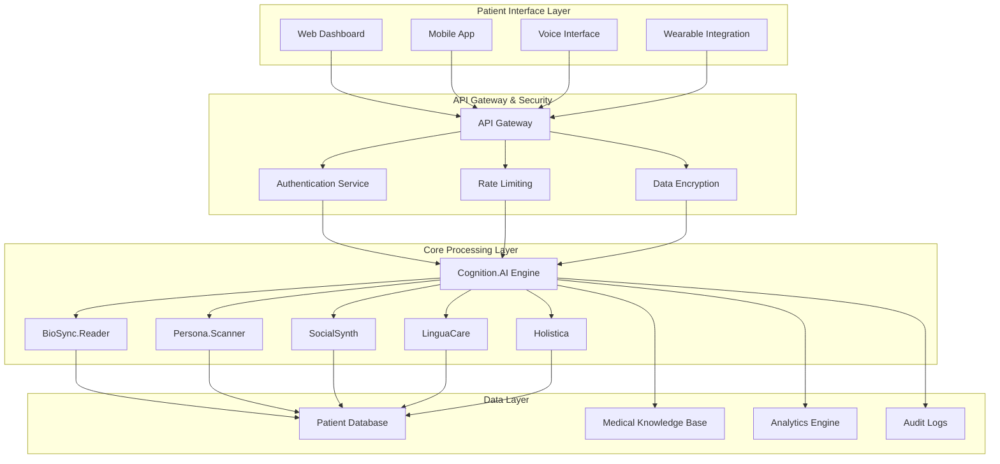
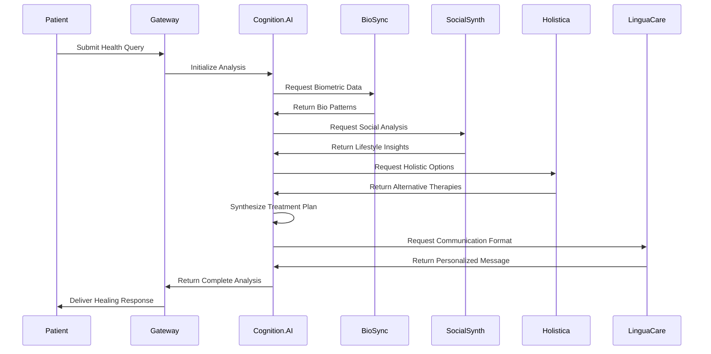
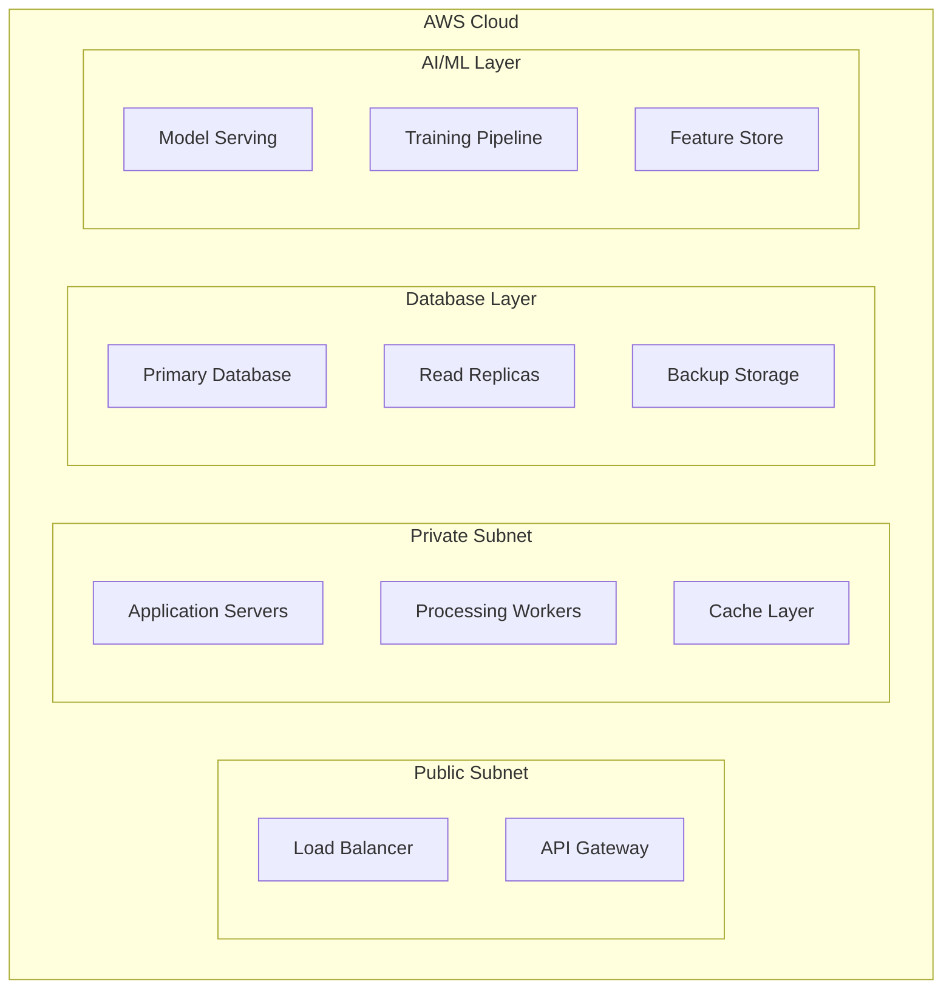

# 🏛️ **Lilith.Eve Architecture Guide**

> *"The divine blueprint of consciousness and healing"*

## 🌟 **System Overview**

Lilith.Eve operates as a **distributed, event-driven microservices architecture** designed for maximum scalability, security, and healing precision. The system embodies the principle of **holistic integration** where each component works in harmony with the others to provide comprehensive medical insights.

## 🏗️ **High-Level Architecture**



## 🧠 **Core Module Specifications**

### **1. Cognition.AI Engine**

**Purpose**: The central intelligence hub that synthesizes all medical knowledge and makes treatment decisions.

**Technical Stack**:
- **Primary LLM**: GPT-4 with medical fine-tuning
- **Secondary LLM**: Claude for reasoning validation
- **Custom Models**: Domain-specific medical knowledge models
- **Vector Database**: Pinecone for medical knowledge retrieval
- **Reasoning Engine**: Custom logic for treatment decision trees

**Key Features**:
- Multi-modal medical knowledge synthesis
- Real-time treatment plan generation
- Risk assessment and mitigation
- Continuous learning from outcomes
- Explainable AI for medical decisions

**API Endpoints**:
```typescript
interface CognitionAI {
  analyzePatient(profile: PatientProfile): Promise<MedicalAnalysis>
  generateTreatmentPlan(analysis: MedicalAnalysis): Promise<TreatmentPlan>
  assessRisk(patient: PatientProfile, treatment: TreatmentPlan): Promise<RiskAssessment>
  explainDecision(decision: MedicalDecision): Promise<Explanation>
}
```

### **2. BioSync.Reader**

**Purpose**: Processes and analyzes real-time biometric data from various sensors and devices.

**Technical Stack**:
- **IoT Integration**: AWS IoT Core for device management
- **Signal Processing**: Python with NumPy/SciPy
- **Machine Learning**: TensorFlow for pattern recognition
- **Real-time Processing**: Apache Kafka for data streams
- **Device APIs**: Integration with major wearable platforms

**Supported Devices**:
- Apple Watch, Fitbit, Garmin
- EEG headsets (Muse, NeuroSky)
- ECG monitors
- Blood pressure cuffs
- Glucose monitors
- Sleep trackers

**Data Processing Pipeline**:
```python
class BioSyncReader:
    def __init__(self):
        self.signal_processors = {
            'eeg': EEGProcessor(),
            'ecg': ECGProcessor(),
            'hrv': HRVProcessor(),
            'sleep': SleepProcessor()
        }
    
    async def process_biometrics(self, data: BiometricData) -> BioPattern:
        processor = self.signal_processors[data.type]
        return await processor.analyze(data)
```

### **3. Persona.Scanner**

**Purpose**: Analyzes patient context including cultural background, beliefs, and psychological patterns.

**Technical Stack**:
- **NLP Engine**: spaCy with custom medical entity recognition
- **Cultural Database**: Comprehensive cultural medicine knowledge
- **Psychological Profiling**: Integration with psychological assessment tools
- **Sentiment Analysis**: Custom models for emotional state detection
- **Cultural Sensitivity**: AI models trained on diverse cultural contexts

**Analysis Components**:
- Cultural background and traditions
- Religious beliefs and practices
- Educational level and health literacy
- Trauma history and triggers
- Communication preferences
- Family dynamics and support systems

### **4. SocialSynth**

**Purpose**: Analyzes social media and digital behavior for lifestyle and health insights.

**Technical Stack**:
- **Social Media APIs**: Twitter, Instagram, Facebook (with consent)
- **Text Analysis**: Custom NLP models for health-related content
- **Pattern Recognition**: ML models for behavioral analysis
- **Privacy Protection**: Advanced anonymization and consent management
- **Real-time Monitoring**: Stream processing for crisis detection

**Privacy Safeguards**:
- Explicit consent for each data source
- Data anonymization and encryption
- Granular permission controls
- Automatic data deletion policies
- Transparent audit trails

### **5. LinguaCare**

**Purpose**: Adapts medical communication to patient's language, culture, and comprehension level.

**Technical Stack**:
- **Translation Engine**: DeepL API with medical terminology
- **Cultural Linguistics**: Custom models for cultural communication patterns
- **Readability Analysis**: Flesch-Kincaid and medical readability scores
- **Emotional Intelligence**: Sentiment-aware communication
- **Multimodal Output**: Text, voice, visual, and interactive formats

**Communication Styles**:
- **Compassionate**: Warm, empathetic, supportive
- **Clinical**: Precise, technical, evidence-based
- **Cultural**: Respectful of traditions and beliefs
- **Educational**: Patient empowerment and understanding

### **6. Holistica**

**Purpose**: Integrates traditional, alternative, and energetic healing modalities.

**Technical Stack**:
- **Traditional Medicine Database**: Comprehensive knowledge base
- **Herbal Medicine**: Integration with botanical databases
- **Energy Healing**: Mapping of energetic systems
- **Cultural Practices**: Respectful integration of traditional methods
- **Evidence Synthesis**: Scientific validation where available

**Healing Modalities**:
- Traditional Chinese Medicine
- Ayurvedic practices
- Native American healing
- Herbal medicine
- Energy healing (Reiki, chakra work)
- Mind-body practices (yoga, meditation)

## 🔄 **Data Flow Architecture**

### **Patient Data Processing Pipeline**



## 🗄️ **Data Architecture**

### **Database Schema Overview**

```sql
-- Core Patient Data
CREATE TABLE patients (
    id UUID PRIMARY KEY,
    encrypted_profile JSONB,
    cultural_context JSONB,
    consent_settings JSONB,
    created_at TIMESTAMP,
    updated_at TIMESTAMP
);

-- Medical Records
CREATE TABLE medical_records (
    id UUID PRIMARY KEY,
    patient_id UUID REFERENCES patients(id),
    record_type VARCHAR(50),
    encrypted_data JSONB,
    source_system VARCHAR(100),
    created_at TIMESTAMP
);

-- Treatment Plans
CREATE TABLE treatment_plans (
    id UUID PRIMARY KEY,
    patient_id UUID REFERENCES patients(id),
    plan_data JSONB,
    risk_assessment JSONB,
    cultural_considerations JSONB,
    created_at TIMESTAMP,
    expires_at TIMESTAMP
);

-- Audit Logs
CREATE TABLE audit_logs (
    id UUID PRIMARY KEY,
    user_id UUID,
    action VARCHAR(100),
    resource_type VARCHAR(50),
    resource_id UUID,
    encrypted_details JSONB,
    timestamp TIMESTAMP
);
```

## 🔐 **Security Architecture**

### **Multi-Layer Security Model**

1. **Transport Layer**: TLS 1.3 encryption
2. **Application Layer**: JWT tokens with short expiration
3. **Data Layer**: Field-level encryption with customer-managed keys
4. **Network Layer**: VPC isolation and security groups
5. **Access Layer**: Role-based access control (RBAC)

### **Privacy by Design**

- **Data Minimization**: Only collect necessary data
- **Purpose Limitation**: Clear data usage boundaries
- **Consent Management**: Granular consent controls
- **Right to Deletion**: Complete data removal capabilities
- **Transparency**: Clear audit trails and explanations

## ⚡ **Performance Architecture**

### **Scalability Design**

- **Horizontal Scaling**: Auto-scaling based on demand
- **Load Balancing**: Intelligent request distribution
- **Caching Strategy**: Multi-layer caching for performance
- **Database Optimization**: Read replicas and query optimization
- **CDN Integration**: Global content delivery

### **Monitoring & Observability**

- **Application Metrics**: Response times, error rates, throughput
- **Business Metrics**: Treatment success rates, patient satisfaction
- **Security Metrics**: Failed authentication attempts, data access patterns
- **Infrastructure Metrics**: CPU, memory, network utilization

## 🌐 **Deployment Architecture**

### **Cloud Infrastructure**



### **Environment Strategy**

- **Development**: Local development with Docker
- **Staging**: Full production-like environment
- **Production**: Multi-region deployment for high availability
- **Disaster Recovery**: Automated backup and recovery procedures

## 🔮 **Future Architecture Considerations**

### **Emerging Technologies Integration**

- **Quantum Computing**: For complex medical simulations
- **Edge Computing**: Local processing for privacy-sensitive data
- **Blockchain**: For immutable medical records
- **5G Networks**: For real-time remote monitoring
- **AR/VR**: For immersive healing experiences

### **AI/ML Evolution**

- **Federated Learning**: Privacy-preserving model training
- **Few-Shot Learning**: Adaptation to rare medical conditions
- **Causal Inference**: Understanding treatment causality
- **Multimodal AI**: Integration of text, image, and sensor data

---

*"In the architecture of Lilith.Eve, every component serves the divine purpose of healing, guided by wisdom, compassion, and technological excellence."* 