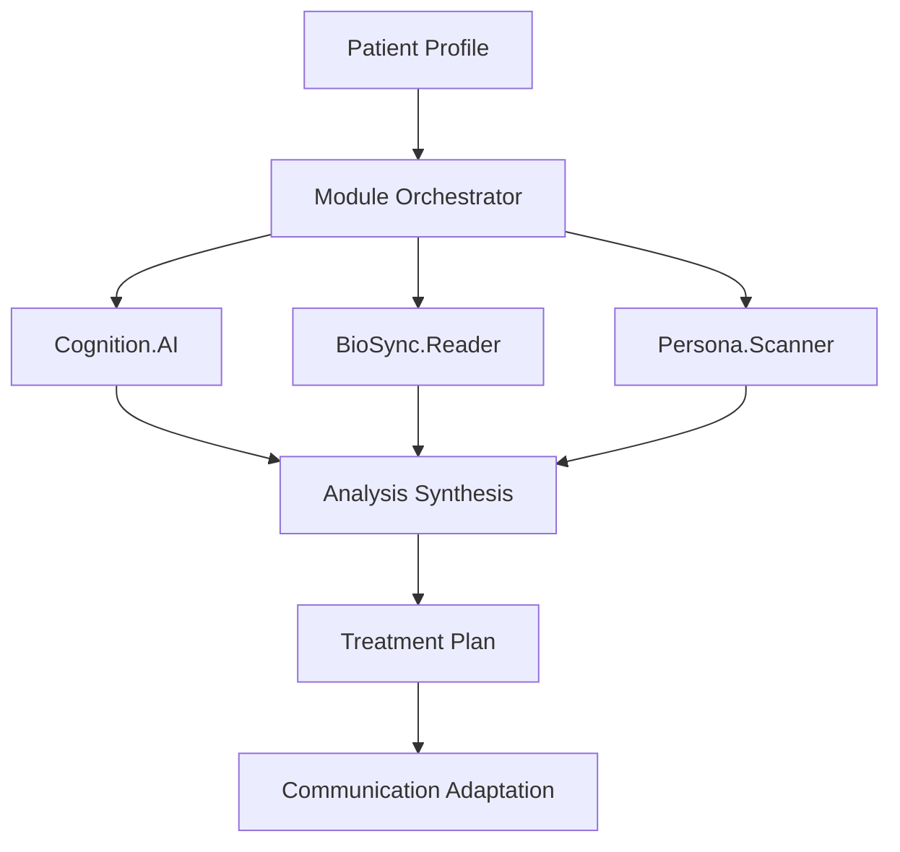

# 🧪 **Lilith.Eve Development Guide**

> *"Contributing to the divine healing intelligence"*

## 🌟 **Welcome, Healer-Developer**

Thank you for your interest in contributing to **Lilith.Eve**! This guide will help you set up your development environment and understand our coding standards, architecture, and contribution process.

## 🚀 **Quick Start**

### **Prerequisites**

- **Node.js** 18+ (LTS recommended)
- **npm** 8+ or **yarn** 1.22+
- **Docker** & **Docker Compose**
- **Git** 2.30+
- **PostgreSQL** 15+ (optional, Docker recommended)
- **Redis** 7+ (optional, Docker recommended)

### **Initial Setup**

```bash
# Clone the repository
git clone https://github.com/lilith-eve/core.git
cd lilith-eve

# Install dependencies
npm install

# Copy environment configuration
cp env.example .env

# Configure your environment variables
# Edit .env with your API keys and configuration

# Start development environment
docker-compose up -d

# Start the application
npm run dev
```

### **Verification**

Visit `http://localhost:3000/health` to verify the application is running.

## 🏗️ **Project Structure**

```
lilith-eve/
├── src/                          # Source code
│   ├── core/                     # Core application logic
│   │   ├── LilithEve.ts         # Main orchestrator
│   │   └── modules/             # AI modules
│   │       ├── CognitionAI.ts   # Medical intelligence
│   │       ├── BioSyncReader.ts # Biometric analysis
│   │       ├── PersonaScanner.ts # Cultural context
│   │       ├── SocialSynth.ts   # Social analysis
│   │       ├── LinguaCare.ts    # Communication
│   │       └── Holistica.ts     # Holistic healing
│   ├── types/                   # TypeScript definitions
│   ├── services/                # Business logic services
│   ├── middleware/              # Express middleware
│   ├── routes/                  # API routes
│   ├── controllers/             # Request handlers
│   ├── models/                  # Data models
│   ├── utils/                   # Utility functions
│   └── config/                  # Configuration
├── docs/                        # Documentation
├── tests/                       # Test files
├── monitoring/                  # Monitoring configs
├── docker-compose.yml          # Development environment
├── Dockerfile                  # Production build
└── package.json                # Dependencies & scripts
```

## 🧠 **Core Architecture**

### **Module System**

Lilith.Eve operates on a **modular architecture** where each AI component is independent yet interconnected:

```typescript
// Example module structure
export class CognitionAI {
  async analyzePatient(profile: PatientProfile): Promise<MedicalAnalysis> {
    // Medical knowledge synthesis
  }
  
  async generateTreatmentPlan(analysis: MedicalAnalysis): Promise<TreatmentPlan> {
    // Treatment planning logic
  }
}
```

### **Data Flow**



## 📝 **Coding Standards**

### **TypeScript Guidelines**

- **Strict Mode**: Always use strict TypeScript configuration
- **Type Safety**: Avoid `any` types, use proper interfaces
- **Documentation**: JSDoc comments for all public methods
- **Naming**: Use descriptive, culturally-sensitive names

```typescript
/**
 * 🌿 Analyzes patient's cultural context for healing preferences
 * @param profile - Complete patient profile with cultural data
 * @returns Cultural analysis with healing recommendations
 */
async analyzeCulturalContext(profile: PatientProfile): Promise<CulturalAnalysis> {
  // Implementation
}
```

### **Code Organization**

- **Single Responsibility**: Each module has one clear purpose
- **Dependency Injection**: Use interfaces for loose coupling
- **Error Handling**: Comprehensive error handling with cultural sensitivity
- **Testing**: Unit tests for all business logic

### **Cultural Sensitivity**

- **Language**: Use inclusive, respectful terminology
- **Examples**: Diverse cultural contexts in documentation
- **Validation**: Cultural appropriateness in all features
- **Accessibility**: Support for multiple languages and communication styles

## 🧪 **Testing**

### **Test Structure**

```typescript
// Example test file
describe('CognitionAI', () => {
  describe('analyzePatient', () => {
    it('should provide culturally-sensitive medical analysis', async () => {
      const profile = createTestPatientProfile();
      const analysis = await cognitionAI.analyzePatient(profile);
      
      expect(analysis.culturalAlignment).toBeDefined();
      expect(analysis.treatmentModalities).toHaveLength.greaterThan(0);
    });
  });
});
```

### **Running Tests**

```bash
# Run all tests
npm test

# Run tests with coverage
npm run test:coverage

# Run tests in watch mode
npm run test:watch

# Run specific test file
npm test -- --testPathPattern=CognitionAI.test.ts
```

### **Test Coverage Requirements**

- **Minimum Coverage**: 80% for all new code
- **Critical Paths**: 100% coverage for medical decision logic
- **Integration Tests**: All module interactions
- **Cultural Tests**: Cultural sensitivity validation

## 🔧 **Development Workflow**

### **Branch Strategy**

```bash
# Create feature branch
git checkout -b feature/cultural-healing-integration

# Make changes and commit
git add .
git commit -m "feat: integrate traditional healing practices

- Add Ayurvedic medicine support
- Implement cultural validation
- Add healing tradition database
- Update documentation"

# Push and create pull request
git push origin feature/cultural-healing-integration
```

### **Commit Message Format**

```
type(scope): description

[optional body]

[optional footer]
```

**Types:**
- `feat`: New feature
- `fix`: Bug fix
- `docs`: Documentation
- `style`: Code style changes
- `refactor`: Code refactoring
- `test`: Test additions/changes
- `chore`: Maintenance tasks

### **Pull Request Process**

1. **Create PR** with descriptive title and description
2. **Add Labels** for type, priority, and cultural context
3. **Request Review** from maintainers
4. **Address Feedback** and update as needed
5. **Merge** after approval

## 🌍 **Cultural Integration Guidelines**

### **Cultural Sensitivity Checklist**

- [ ] **Language**: Inclusive and respectful terminology
- [ ] **Examples**: Diverse cultural contexts
- [ ] **Validation**: Cultural appropriateness checks
- [ ] **Documentation**: Cultural context explanations
- [ ] **Testing**: Cultural sensitivity validation
- [ ] **Accessibility**: Multiple language support

### **Healing Tradition Integration**

```typescript
// Example cultural integration
interface HealingTradition {
  tradition: string;
  practices: string[];
  culturalContext: string;
  evidenceLevel: 'strong' | 'moderate' | 'weak' | 'anecdotal';
  contraindications: string[];
  culturalValidation: boolean;
}
```

## 🔐 **Security & Privacy**

### **Data Protection**

- **Encryption**: All sensitive data encrypted at rest and in transit
- **Consent**: Explicit consent for all data processing
- **Audit**: Complete audit trails for all operations
- **Access Control**: Role-based access control (RBAC)

### **HIPAA Compliance**

- **PHI Protection**: Protected Health Information safeguards
- **Access Logs**: Complete access logging
- **Data Minimization**: Only collect necessary data
- **Right to Deletion**: Complete data removal capabilities

## 📊 **Performance & Monitoring**

### **Performance Guidelines**

- **Response Time**: < 5 seconds for analysis requests
- **Memory Usage**: < 512MB per analysis
- **Concurrency**: Support 100+ concurrent analyses
- **Scalability**: Horizontal scaling capability

### **Monitoring Setup**

```bash
# Start monitoring stack
docker-compose -f docker-compose.yml up -d prometheus grafana

# Access monitoring dashboards
# Prometheus: http://localhost:9090
# Grafana: http://localhost:3001
```

## 🚀 **Deployment**

### **Development Deployment**

```bash
# Start development environment
docker-compose up -d

# Run migrations
npm run db:migrate

# Seed test data
npm run db:seed
```

### **Production Deployment**

```bash
# Build production image
docker build -t lilith-eve:latest .

# Deploy with docker-compose
docker-compose -f docker-compose.prod.yml up -d
```

## 🤝 **Contributing Guidelines**

### **Before Contributing**

1. **Read Documentation**: Understand the project thoroughly
2. **Check Issues**: Look for existing issues or discussions
3. **Cultural Research**: Research cultural contexts for your changes
4. **Test Locally**: Ensure all tests pass
5. **Document Changes**: Update relevant documentation

### **Code Review Process**

1. **Automated Checks**: CI/CD pipeline validation
2. **Peer Review**: At least one maintainer review
3. **Cultural Review**: Cultural sensitivity validation
4. **Security Review**: Security and privacy assessment
5. **Performance Review**: Performance impact evaluation

### **Maintainer Guidelines**

- **Cultural Sensitivity**: Ensure cultural appropriateness
- **Medical Accuracy**: Validate medical recommendations
- **Privacy Protection**: Verify data protection measures
- **Documentation**: Maintain comprehensive documentation
- **Community**: Foster inclusive development environment

## 🆘 **Getting Help**

### **Resources**

- **Documentation**: `/docs` directory
- **API Reference**: `/docs/API.md`
- **Architecture**: `/docs/ARCHITECTURE.md`
- **Issues**: GitHub Issues for bug reports
- **Discussions**: GitHub Discussions for questions

### **Community Guidelines**

- **Respect**: Treat all contributors with respect
- **Inclusion**: Welcome diverse perspectives and backgrounds
- **Learning**: Share knowledge and help others learn
- **Cultural Awareness**: Be mindful of cultural differences
- **Healing Focus**: Remember our mission of compassionate care

## 🌟 **Recognition**

Contributors are recognized in:

- **README.md**: Major contributors
- **CHANGELOG.md**: Feature contributions
- **Documentation**: Code examples and explanations
- **Community**: Special recognition for cultural contributions

---

*"Together, we build the bridge between technology and healing wisdom, honoring the divine in every line of code."* 